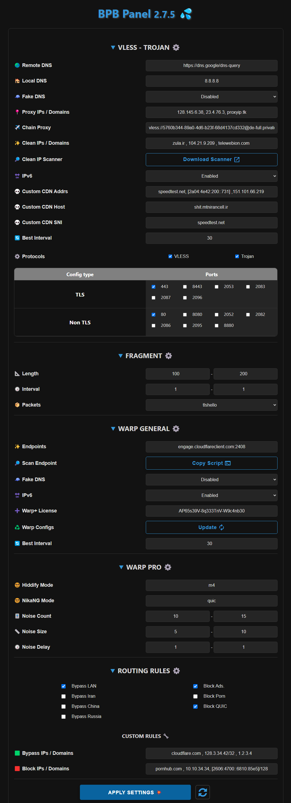

<h1 align="center">💦 BPB 面板</h1>

  

 

## 简介
本项目致力于为 [yonggekkk](https://github.com/yonggekkk) 开发的 [Cloudflare-workers/pages 代理脚本](https://github.com/yonggekkk/Cloudflare-workers-pages-vless) 构建用户面板。该面板提供两种部署方式：
- **Worker** 部署
- **Pages** 部署
 

🌟 如果您觉得 **BPB Panel** 对您有帮助，欢迎赞助支持 🌟
- **USDT (BEP20):** `0x111EFF917E7cf4b0BfC99Edffd8F1AbC2b23d158`

## 特性

1. **免费**: 完全免费使用。
2. **用户友好界面:** 设计简洁，易于配置和使用。
3. **多协议支持:** 支持 VLESS、Trojan 和 Wireguard (Warp) 协议。
4. **Warp Pro 配置:** 针对特殊情况优化的 Warp 配置。
5. **Fragment 支持:** 支持在特殊网络环境下使用 Fragment 功能。
6. **完整路由规则:** 支持绕过伊朗/中国/俄罗斯和局域网，屏蔽 QUIC、色情、广告、恶意软件、钓鱼网站等。
7. **链式代理:** 可添加链式代理以修复 IP 问题。
8. **广泛的客户端支持:** 提供 Xray、Sing-box 和 Clash 核心客户端的订阅链接。
9. **密码保护:** 面板支持密码保护功能。
10. **完全可定制:** 支持在线扫描和设置干净的 IP 域名、代理 IP、DNS 服务器、端口和协议选择、Warp 端点等。
 

## 使用方法:
- [安装教程 (Pages)](docs/pages_installation.md)

- [安装教程 (Worker)](docs/worker_installation.md)

- [使用说明](docs/configuration.md)

- [常见问题](docs/faq.md)
 

## 支持的客户端
| 客户端  | 版本要求 | Fragment支持 | Warp Pro支持 |
| :-------------: | :-------------: | :-------------: | :-------------: |
| **v2rayNG**  | 1.8.19 或更高  | :heavy_check_mark: | :x: |
| **v2rayN**  | 6.42 或更高  | :heavy_check_mark: | :x: |
| **v2rayN-PRO**  | 1.4 或更高  | :heavy_check_mark: | :heavy_check_mark: |
| **Nekobox**  |   | :x: | :x: |
| **Sing-box**  | 1.8.10 或更高  | :x: | :x: |
| **Streisand**  |   | :heavy_check_mark: | :x: |
| **V2Box**  |   | :x: | :x: |
| **Shadowrocket**  |   | :x: | :x: |
| **Nekoray**  |   | :heavy_check_mark: | :x: |
| **Hiddify**  | 2.0.5 或更高  | :x: | :heavy_check_mark: |
| **NikaNG**  |   | :heavy_check_mark: | :heavy_check_mark: |
| **Clash Meta**  |   | :x: | :x: |
| **Clash Verge Rev**  |   | :x: | :x: |
| **FLClash**  |   | :x: | :x: |

---

## Star 数量统计

---

### 特别感谢
- CF-vless 代码作者 [3Kmfi6HP](https://github.com/3Kmfi6HP/EDtunnel)
- CF 优选 IP 程序作者 [badafans](https://github.com/badafans/Cloudflare-IP-SpeedTest), [XIU2](https://github.com/XIU2/CloudflareSpeedTest)

---

关于核心脚本的详细教程，请参考 [Yongge 的博客和视频教程](https://ygkkk.blogspot.com/2023/07/cfworkers-vless.html)。
