<h1 align="center">使用说明和配置指南</h1>

假设你的 worker 或 pages 名称是 `worker-polished-leaf-d022`：

你可以通过在末尾添加 `panel/` 来访问面板，如下所示：

>`https://worker-polished-leaf-d022.workers.dev/panel`

系统会要求你设置新密码并登录，就这么简单。

> [!IMPORTANT]
> 密码必须至少包含 **8个字符**，且至少包含一个**大写字母**和一个**数字**。以后你也可以从面板底部更改密码。
让我们来看看面板的不同部分：
  

# 1 - Normal 订阅

  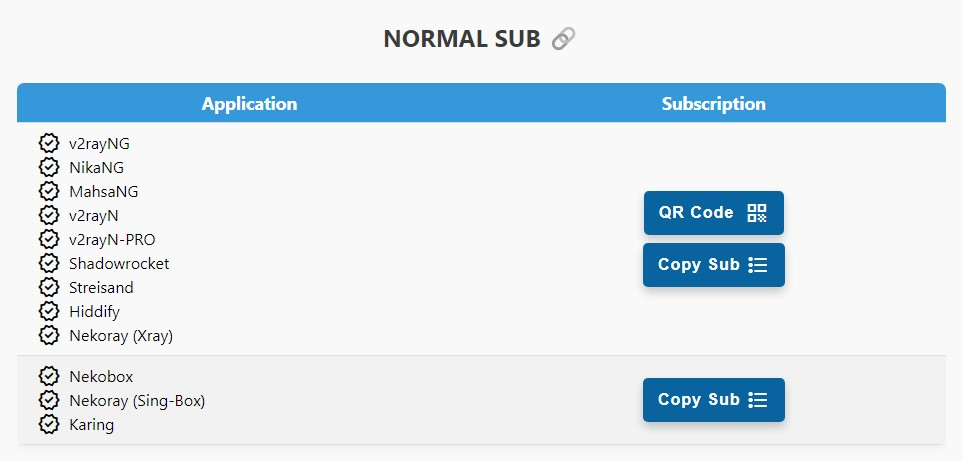

我从这部分开始是因为很多人喜欢不使用 Fragment 或面板设置直接使用，但请注意，你需要知道如何在应用程序中进行配置，否则可能会遇到问题。建议使用 `Full Normal` 订阅，因为它们已经应用了所有面板设置，无需进行任何特殊操作。请注意，面板的路由规则、链式代理和 DNS 设置不会应用到这个订阅（需要在程序中手动设置）。

这个链接会提供 6 个配置。（你可以通过清洁 IP 设置、端口和协议设置来增加配置数量）这 6 个配置有什么区别？

- **Websocket 路径：** 每个配置都有不同的路径。
- **配置地址：** 在这 6 个配置中，第一个是你的 worker 域名，第二个是 www.speedtest.net（在大多数运营商上都很干净），第 3-6 个是你域名的 IP（通常也很干净）。两个 IPv4 和两个 IPv6。

如何增加配置数量？更多说明和设置请参见 [添加清洁 IP](#1-4--清洁-ip-设置) 和 [添加端口](#1-9--端口选择)、[选择协议](#1-8--协议选择) 和 [添加自定义 CDN](#1-6--自定义-cdn-设置) 部分。

> [!CAUTION]
> 使用此订阅时，请在你使用的任何应用程序的设置中关闭 Mux。

> [!WARNING]
> 使用此 Worker 会经常改变你的设备 IP，因此不要用于交易、PayPal 以及像 Hetzner 这样对 IP 敏感的网站，有被封禁的风险。关于固定 IP，我们提供了两个解决方案：一是在设置时配置 [Proxy IP](#1-2--proxy-ip-设置)，二是使用 [Chain Proxy](#1-3--链式代理设置)。
  

# 2 - Full Normal 订阅

  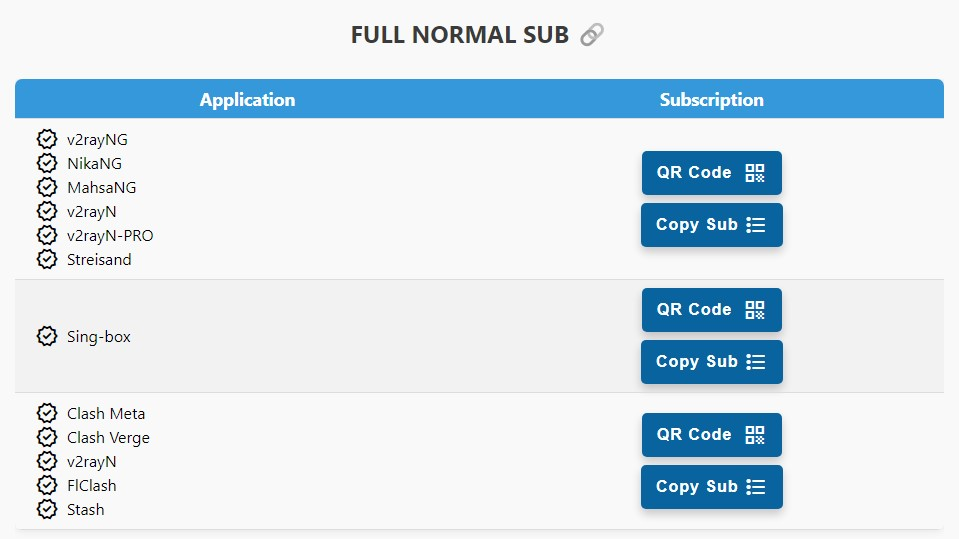

这个订阅提供与上面相同的配置，但区别在于它应用了面板 VLESS / Trojan 部分的所有设置，你可以在[这里](#1--vlesstrojan-设置)了解。此外，这些订阅还包含 **Best Ping** 配置（稍后解释）。通过应用路由设置，它可以屏蔽约 90% 的国内外广告，绕过中国和伊朗网站（无需为支付网关等关闭 VPN），绕过 LAN，屏蔽色情和 QUIC，而且 Sing-box 订阅还能很好地屏蔽钓鱼和恶意软件等内容。

> [!TIP]
> 什么是 **Best Ping** 配置？这个配置整合了面板的所有配置，每 30 秒检查哪个配置速度更好并连接到那个！如果你添加了清洁 IP 或启用了 Trojan 协议或选择了其他端口，它们也会被添加到 Best Ping 中。这种类型的配置在 Fragment 和 Warp 订阅中也有。

[接下来是更多详细内容...] 

# 3 - Fragment 订阅

  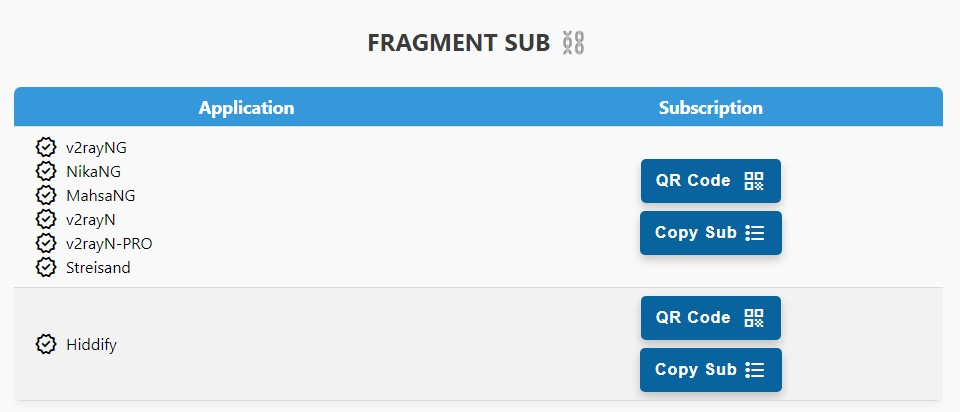

> [!NOTE]
> **Fragment 配置的特点**
> 
> 1- 即使个人域名或 worker 被封锁也能保持连接
> 
> 2- 改善所有运营商(特别是在 Cloudflare 上有干扰的运营商)的连接质量和速度

 

## 3-1 - Xray 的 Fragment 订阅

这是针对使用 Xray 内核的应用程序，实际上就是面板中 FRAGMENT SUB 表格的第一行，导入方式与普通订阅相同。这部分的配置名称中都带有 `F`。

这个订阅会提供与 Full Normal 订阅相同数量的配置(使用你在面板中置的 fragment 参数)，外加 **Best Fragment** 和 **Workerless** 配置。你在面板中进行的任何设置更改，在更新订阅后都会应用到所有配置。

> [!TIP]
> WorkerLess 配置不使用 worker 就能打开很多被封锁的网站和应用！比如 YouTube、Twitter、Google Play 等被封锁的网站。请注意，由于这个配置不使用 worker，所以不会改变你的 IP，因此不适合需要安全性的场景。你在面板中对 fragment 所做的更改也会应用到这个配置，但 Chain Proxy 除外。

> [!TIP]
> Best Fragment 配置会应用 18 种不同的 fragment 值，并根据你的运营商选择速度最快的那个！这 18 种组合经过精心选择，确保覆盖所有范围，配置每分钟测试所有大小范围并连接到最佳选项。
Fragment 的高级设置在[这里](#4-2--fragment-设置)有详细说明。
  

## 3-2 - Hiddify 的 Fragment 订阅

FRAGMENT SUB 表格的第二行是为 Hiddify 程序提供的 fragment 使用方式，但有一点不同。由于程序的限制，面板的许多设置不会应用到这个订阅，实际上是程序自己重写了这些设置。这部分的配置名称中都带有 `F`。以下设置需要在 Hiddify 程序中手动设置，目前无法从面板应用：

 1. Remote DNS
 2. Local DNS
 3. Fragment Packets
 4. Routing

> [!CAUTION]
> 1- 一定要在程序设置中将 Remote DNS 更改为一个 DOH，例如：
> https://8.8.8.8/dns-query 或 https://94.140.14.14/dns-query
> 如果在这里使用 ...//:udp 或纯 IP，你的 worker 将无法工作。
> 
> 2- 如果你在程序中手动开启了 Fragment，面板的 fragment 设置将不会生效。

还有另一种方法，就是将普通订阅导入 Hiddify 程序，然后像下图这样手动启用 fragment：

  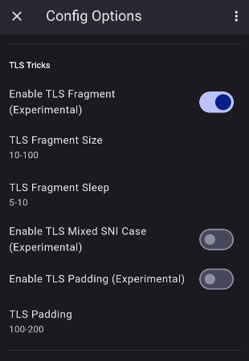

  

# 4- Warp 订阅

  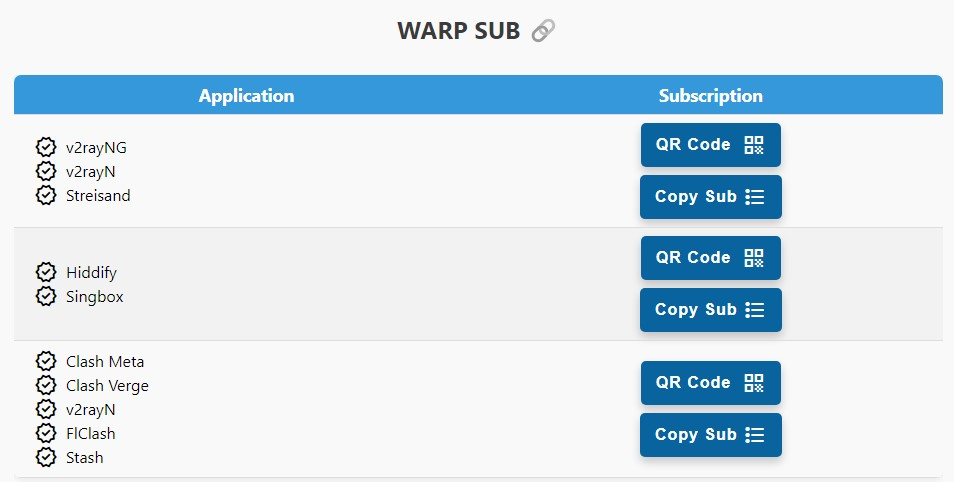

这个订阅提供一个 IP 为伊朗的 Warp 配置，一个 IP 为国外的 Warp on Warp (简称 WoW) 配置(目前由于 Cloudflare 的变化，有时会给出伊朗 IP)，一个始终使用伊朗 IP 的 Warp Best Ping 配置，以及一个使用国外 IP 的 WoW Best Ping 配置。默认情况下只有一个 Warp 和 WoW 配置，但如果你编辑 Endpoints 部分，配置数量会根据输入的 Endpoint 数量增加。

请记住一定要使用扫描器在你的运营商上找到合适的 Endpoint。面板中有扫描器脚本，复制它并在安卓的 Termux 中运行。关于如何放入面板，请参考高级设置 7-4 部分。普通 warp 订阅可能在某些运营商(如 Irancell)上工作良好，但对其他运营商，请使用 Warp Pro 订阅。

# 5- Warp Pro 订阅

  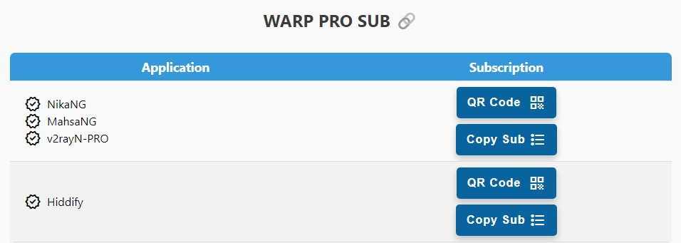

由于 GFW-Knocker 团队和 Hiddify 团队在 Xray 和 Singbox 内核上的新开发，我们现在有了 MahsaNG、NikaNG、v2rayN-PRO 和 Hiddify 这些程序，它们让我们能够针对特定环境优化 Warp 连接，类似于 Oblivion 的工作方式。因此，我在面板中添加了 WARP PRO SUB，可以通过 WARP PRO SETTINGS 部分进行自定义。每个运营商的最佳值需要通过实践来确定，就像 Fragment 设置一样，在不同时间可能也会有所不同，但默认值已经过测试，目前工作良好，你只需要设置合适的 Endpoint。

> [!CAUTION]
> Hiddify 应用程序版本必须至少为 2.0.5。

 
<h1 align="center">My IP 表格</h1>

  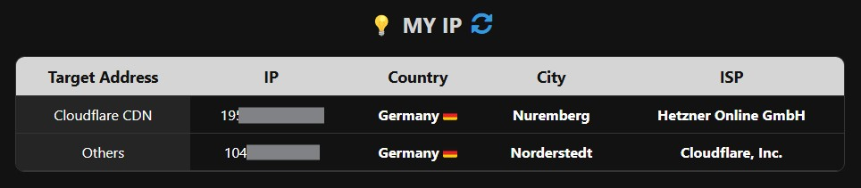

连接到代理后，你可以刷新页面并查看此表格来检查你的 IP。该表格有两行，第一行显示你在 Cloudflare 地址上的 IP，如果你设置了 Proxy IP，那么你在 Cloudflare 地址上的 IP 将是这个 Proxy IP，而对于其他地址则是随机的 Cloudflare IP。通过这种方式，你可以检查所选的 Proxy IP 是否生效。如果你使用 Warp 配置连接，格���两行应该显示相同的 IP。注意，如果你使用 uBlock Origin 扩展，需要禁用它才能使这部分正常工作。

  

<h1 align="center">高级设置</h1>

首先说明，如果你进行了任何错误的更改，不用担心，在 APPLY SETTINGS 按钮旁边有一个 Reset 按钮，可以将面板恢复到默认设置。
  

## 1- VLESS/TROJAN 设置

  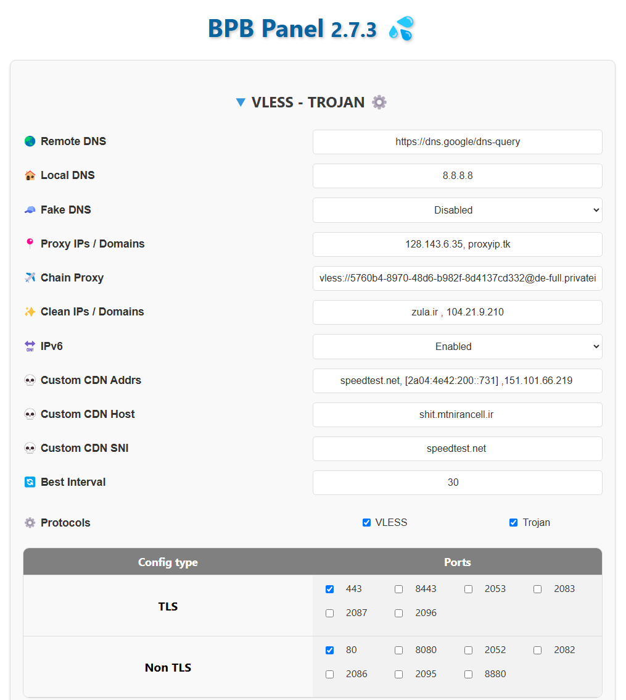

这部分用于 Fragment 配置和 Clash、Singbox 订阅的设置，对普通 v2ray 配置部分和 Warp 订阅没有影响。

### 1-1- DNS 服务器

默认情况下，我设置 Google DOH 作为 Remote DNS，Google DNS 作为 Local DNS。即默认配置为：

>`Remote DNS: https://8.8.8.8/dns-query`
>
>`Local DNS: 8.8.8.8`

> [!CAUTION]
> 绝对不要使用 `https://1.1.1.1/dns-query` 或 `https://cloudflare-dns.com/dns-query` 作为 remote DNS，因为这会增加延迟并使连接不稳定。

> [!TIP]
> 从版本 2.5.5 开始，你可以使用官方的 DOH 或 DOT，确保它们能提供最佳性能，这里有一些例子：
>
> `https://dns.google/dns-query`
>
> `https://dns.adguard-dns.com/dns-query`
>
> `https://dns.quad9.net/dns-query`
>
> `tls://dns.google`

你也可以启用 Fake DNS，这有助于提高 DNS 速度，但请注意它可能与某些程序不兼容或影响系统 DNS，因此如果你不确定它是什么，最好不要启用它。

### 1-2- Proxy IP 设置

从版本 2.3.5 开始，你可以直接通过面板更改 Proxy IP，只需应用设置并更新订阅即可。但我建议使用旧的 Cloudflare 控制面板方法，原因如下：

> [!CAUTION]
> 如果你通过面板设置 Proxy IP，当该 IP 失效时，你需要替换一个新的 IP 并更新订阅。这意味着如果你已经分享了配置给其他人，更改 Proxy IP 将不会生效，因为用户没有订阅来更新配置。因此建议这种方法只用于个人使用。而旧方法的好处是不需要更新配置。

例如，你可以从以下链接选择 Proxy IP，它会显示一些 IP，你可以检查它们的国家并选择一个或多个：

>[Proxy IP](https://www.nslookup.io/domains/bpb.yousef.isegaro.com/dns-records/)

或者你可以按照[这个教程](https://github.com/bia-pain-bache/BPB-Worker-Panel/blob/main/docs/proxy-ip-scanner.md)自己扫描。不过目前扫描器可能效果不太好，你可以尝试一下。

> [!TIP]
> 如果你想要使用多个 Proxy IP，可以用逗号分隔，例如：`151.213.181.145`,`5.163.51.41`,`bpb.yousef.isegaro.com`

  

### 1-3- Chain Proxy 设置

之前我们提到可以设置一个 Proxy IP 来固定 Cloudflare 网站的 IP，但是当访问普通网站时，我们的 IP 仍然是 worker 的 IP，这个 IP 会定期变化。为了让所有网站都使用固定 IP，我们添加了这个部分。我们可以在这里添加一个免费的 VLESS 或 Socks 或 Http 配置（即使在本地被封锁也可以，只要它在其他地方能工作），这样我们的 IP 就会永久固定为这个配置的 IP。

> [!CAUTION]
> 1- 这个配置本身不能是 worker，否则你的最终 IP 仍会改变。
>
> 2- 获取免费配置的来源很多，我推荐 [racevpn.com](https://racevpn.com)，虽然有时间限制，但可以按国家获取配置。你也可以使用 [IRCF](https://ircfspace.github.io/tconfig/) 的配置或 [ی ب خ](https://t.me/TheTVCbot) Telegram 机器人，但他们的一些配置可能已失效。
> 
> 3- VLESS 配置可以是以下类型之一：
> 
> `Reality TCP`
> 
> `Reality GRPC`
> 
> `Reality WS`
> 
> `Reality TCP Header`
> 
> `WS TLS`
> 
> `GRPC TLS`
> 
> `TCP TLS`
> 
> `WS`
> 
> `GRPC`
> 
> `TCP`
> 
> `TCP Header`
>
> 5- Socks 配置可以是以下格式之一：
>
> socks://`address`:`port`
>
> socks://`user`:`pass`@`address`:`port`
>
> 6- Http 配置可以是以下格式之一：
>
> http://`address`:`port`
>
> http://`user`:`pass`@`address`:`port`

### 1-4- 清洁 IP 设置

普通订阅链接(不带 fragment)会提供 6 个配置。你可以在这里增加配置数量。这里还有一个扫描器，你可以根据操作系统下载对应的 zip 文件，解压后运行 CloudflareScanner，测试完成后会在 result.csv 文件中输出结果，你可以根据延迟和下载速度进行选择。建议在 Windows 上运行测试，测试时请确保关闭 VPN。默认情况下会提供不错的 IP，但如果需要进行高级扫描，请参考[这里的指南](https://github.com/bia-pain-bache/Cloudflare-Clean-IP-Scanner/blob/master/README.md)。

> [!TIP]
> 在支持 IPv6 的运营商上(如 Ritel、Irancell 和 Asiatech)，首先在 SIM 卡上启用 IPv6，然后在 V2RayNG 设置中启用 Prefer IPv6 选项，并从这 6 个配置中使用最后两个或使用你自己域名地址的那个。通常建议先点击 Real delay all configuration，然后使用延迟最低的连接。

面板默认提供的 6 个配置都是清洁 IP。另外，如果你使用 Fragment 配置，清洁 IP 就不那么重要了，但某些运营商(如电信)在普通配置上仍然需要清洁 IP。

如果你想在默认的 6 个配置之外添加使用你自己清洁 IP 的配置，按照图片所示，用逗号分隔输入你的清洁 IP 或域名，然后点击 Apply：

  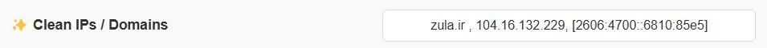

现在如果你在应用程序中更新订阅，就会看到新的配置已添加。

这些新配置同时也会添加到 fragment 部分。

### 1-5- IPv6 启用

面板默认提供 IPv6 配置，但如果你的运营商不支持，为了精简配置列表和优化 DNS 设置，你可以禁用它。
  

### 1-6- 自定义 CDN 设置

我们有 3 个 Custom CDN 字段，用于当你将自己的 Worker 域名放在其他 CDN（如 Fastly 或 Gcore 等）后面时使用。这 3 个部分依次是：

1- `Custom Addr` 部分实际上相当于 Cloudflare 的 IP 或清洁 IP。但是对于使用的任何 CDN，你必须使用它们自己的 IP，不能为 Fastly 或 Gcore 使用 Cloudflare IP。和清洁 IP 一样，你可以用逗号分隔输入域名、IPv4 或 IPv6，注意 IPv6 必须放在 [ ] 中，例如：
> speedtest.net , [2a04:4e42:200::731] , 151.101.66.219

2- `Custom Host` 部分需要填写你在该 CDN 中定义的指向你的 worker 的 host。例如，在 Fastly 中可以定义一个虚拟域名地址。

3- `Custom SNI` 部分可以填写那个虚拟域名，也可以填写一个在同一 CDN 上的网站。例如，speedtest.net（不带 www）就在 Fastly CDN 上。

设置完这部分后，配置会被添加到 Normal 订阅中，包括所有 Sing-box、Clash 和 v2ray 等订阅。这些配置的名称中会包含一个 `C` 以区分。

> [!IMPORTANT]
> 目前只有端口 443 和 80 的配置支持此方法。

> [!TIP]
> 这些配置会出现在 Normal 和 Full Normal 订阅中。但如果你使用 Normal 订阅，需要手动在配置设置中启用 Allow Insecure。Full Normal 会自动应用这个设置。
  

### 1-7- Best Ping 检查时间

在所有 Fragment、Sing-box 和 Clash 订阅中都有 Best Ping 功能。默认情况下，它每 30 秒会找到最佳配置或 Fragment 值并连接到它，但如果网速不好，而你正在观看视频或玩游戏，这个 30 秒的间隔可能会造成问题，导致卡顿。你可以在这里调整时间，最短可以设置为 10 秒，最长为 90 秒。
  

### 1-8- 协议选择

你可以启用 VLESS 和 Trojan 中的一个或两个协议。
> [!CAUTION]
> 这两个协议在 Cloudflare 上不能很好地支持 UDP 连接，因此例如 Telegram 语音通话将无法工作。同时，你也不能使用 UDP DNS 作为 remote DNS。如果你在某个程序中看到 remote DNS 是类似 1.1.1.1 或 udp://1.1.1.1 这样的格式，你会遇到问题。请务必使用以下格式：
>
> `https://IP/dns-query` 如 `https://8.8.8.8/dns-query` , `https://94.140.14.14/dns-query` ....
> 
> `https://doh/dns-query` 如 `https://dns.google/dns-query` , `https://cloudflare-dns.com/dns-query` ....
> 
> `tcp://IP` 如 `tcp://8.8.8.8` , `tcp://94.140.14.14` ....
> 
> `tls://IP` 如 `tls://dns.google` , `tls://cloudflare-dns.com` ....
 

### 1-9- 端口选择

从这部分你可以选择需要的端口。其中一些会提供 TLS 配置，这更安全，但当 TLS 和 Fragment 受到干扰时，这些配置可能会连接失败。
> [!CAUTION]
> 注意，要使用非 TLS 配置，你必须使用 Workers 方式部署。否则，面板中不会显示 http 端口，因为它们在 Pages 方式下不工作。

> [!TIP]
> 非 TLS 配置只会添加到普通订阅中。

## 2- Fragment 设置

  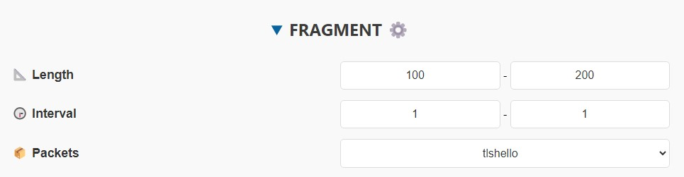

默认设置为：

>`Length: 100-200`
>
>`Interval: 1-1`
>
>`Packets: tlshello`

现在你可以调整这些参数并点击 Apply。这样 fragment 配置就会使用你的设置。

> [!NOTE]
> 你可以只更改一个参数或同时更改所有参数。任何更改都会被保存，下次不需要重新设置。

> [!IMPORTANT]
> fragment 值有最大限制，Length 不能超过 500，Interval 不能超过 30。
  

## 3- WARP 通用设置

  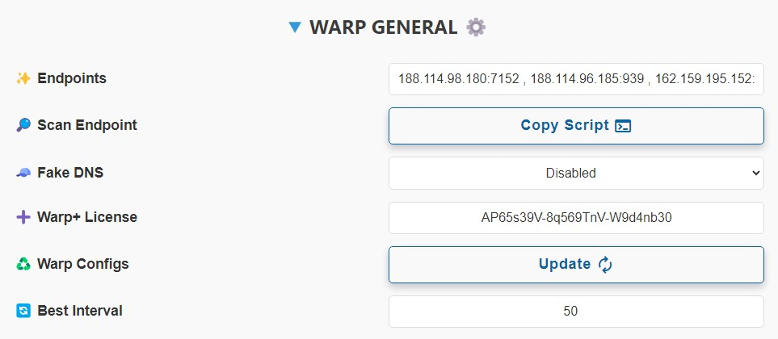

这些设置在 Warp 和 Warp Pro 订阅之间共享，会应用到两者，主要包含两个部分：

1. Endpoints 部分，这些对 Warp 的作用就像清洁 IP 对 VLESS 的作用一样。它们同时应用于 Warp 和 WoW 配置。我还提供了一个扫描脚本，你可以在安卓的 Termux 或 Linux 上运行并将结果添加到面板中，不过这不是 100% 可靠的，你需要自己测试。

> [!CAUTION]
> 注意，Endpoint 必须以 IP:Port 或 Domain:port 的格式输入，并用逗号分隔。
> 
> IPv6 必须放在 [] 中。参考以下示例：
> 
> 123.45.8.6:1701 , engage.cloudflareclient:2408 , [2a06:98c1:3120::3]:939

2. 你也可以为 Warp 配置单独启用 Fake DNS，这有助于提高 DNS 速度，但请注意它可能与某些程序不兼容或影响系统 DNS，因此如果你不确定它是什么，最好不要启用它。

3. 如果你的运营商不支持 IPv6，为了优化 DNS 和代理性能，你可以禁用它。

4. 在 Warp+ License 部分，你可以添加一个 warp plus 许可证来升级你的配置以获得更好的速度。输入后，你需要先点击 Apply 保存，然后从 warp 设置部分点击 Update。你可以从[这里](https://ircfspace.github.io/warpplus/)、这个[Telegram 机器人](https://t.me/generatewarpplusbot)或这个[Telegram 频道](https://t.me/warpplus)获取 Warp Plus 许可证。但请注意，每个许可证只能用于 5 个 warp 配置，而且你每次在面板中使用都会消耗 2 次。换句话说，如果你的许可证未被使用并放入面板，你可以点击两次 Update 将配置升级为 plus，之后会显示 Too many connected device 错误。

> [!CAUTION]
> 如果你从 IRCF 的 Telegram 频道或第一个网站获取许可证，由于它们是公开的，可能一开始就显示 Too many connected devices。但那个 Telegram 机器人提供的都是新的许可证，只是需要完成一些步骤才能使用机器人。

> [!TIP]
> 如果你没有 Warp+ 许可证并点击 Update，它只会更新普通配置，但如果你有许可证，它会将配置升级为 Warp Plus。

> [!TIP]
> 在应用许可证并更新 warp 配置和订阅后连接成功，要检查是否真的升级为 Plus，打开[这个链接](https://cloudflare.com/cdn-cgi/trace)，最后应该显示 warp=plus。

5. Warp Configs 部分的工作方式是，当你点击 Update 时，它会从 Cloudflare 获取新的 warp 配置并保存，如果你更新订阅，你会看到配置已经改变。但这与连接速度完全无关。

6. Best Ping 检查时间。在 Warp 和 Warp PRO 订阅中都有 Best Ping 功能。默认情况下，它每 30 秒会找到最佳配置或 Endpoint 并连接到它，但如果网速不好，而你正在观看视频或玩游戏，这个 30 秒的间隔可能会造成问题，导致卡顿。你可以在这里调整时间，最短可以设置为 10 秒，最长为 90 秒。

## 4- WARP PRO 设置

  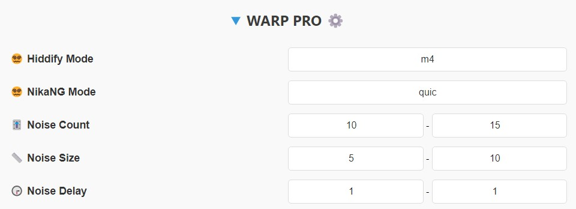

这部分仅适用于前面提到的 WARP PRO 订阅。包含以下几个部分：

1. Hiddify Noise Mode 决定了如何生成噪声(虚假数据包)。Singbox 的 Hiddify 内核支持以下模式：
   
- m1 到 m6 模式
- h_HEX 模式，其中 HEX 可以是 00 到 FF 之间的值，例如 h_0a、h_f9、h_9c 等
- g_HEX_HEX_HEX 模式，HEX 同样是 00 到 FF，例如 g_0a_ff_9c
  
2. NikaNG Noise Mode 包含以下模式：

- none 模式：不生成任何噪声，相当于普通的 warp 配置
- quic 模式：开发团队推荐用于特定环境
- random 模式：随机生成噪声
- 自定义模式：你可以输入自己的 HEX 字符串，例如 fe09ad5600bc...
  
3. Noise Count 设置发送的虚假数据包数量。例如，面板默认设置为发送 10-15 个。

4. Noise Size 设置这些数据包的大小。

5. Noise Delay 设置发送这些噪声包之间的时间间隔。

这些设置的最佳值需要通过对每个运营商的反复测试来确定。

## 5- 路由规则设置

  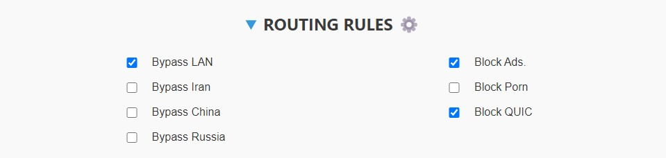

这部分设置允许配置（除了 Normal 订阅提供的配置外）能够：

1. 直接访问 LAN。例如直接访问 127.0.0.1 或 192.168.1.1。
2. 直接访问中国网站（无需为支付网关等关闭 VPN）。
3. 直接访问中国网站。
4. 直接访问俄罗斯网站。
5. 屏蔽约 80% 的国内外广告。
6. 屏蔽色情网站。
7. 屏蔽 QUIC 连接（由于网络不稳定）。

默认情况下此部分是禁用的，因为你需要先确保程序的 Geo asset 是最新的。

> [!CAUTION]
> 如果启用后 VPN 无法连接，唯一的原因是 Geo asset 未更新。进入 v2rayNG 程序菜单的 Geo asset files 部分，点击云图标或下载按钮进行更新。如果更新失败就无法连接。如果尝试多次仍无法更新，请从以下两个链接下载文件，然后不要点击更新，而是点击添加按钮导入这两个文件：
> 
>[geoip.dat](https://github.com/Loyalsoldier/v2ray-rules-dat/releases/latest/download/geoip.dat)
> 
>[geosite.dat](https://github.com/Loyalsoldier/v2ray-rules-dat/releases/latest/download/geosite.dat)

### 5-1- 自定义规则设置

如果你需要上面没有的设置，可以使用这部分。例如，如果你启用了色情网站屏蔽，但某个特定的色情网站没有被屏蔽，你可以在这里添加。

> [!TIP]
> 这部分支持三种格式：
> 
> 1- 域名格式如 `google.com`，注意如果你输入 google.com，它会影响所有子域名，如 drive.google.com 或 mail.google.com
> 
> 2- 可以输入单个 IPv4 或 IPv6，注意 IPv6 必须像面板其他部分一样使用方括号：`[2606:4700::6810:85e5]`
> 
> 3- 可以输入 IP 范围，如 `192.168.1.1`/32 或 128/`[2606:4700::6810:85e5]` 