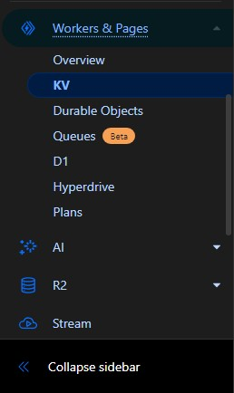

<h1 align="center">通过 Cloudflare Pages 安装</h1>

## 简介
你可能知道在 Cloudflare 上创建代理有 Worker 和 Pages 两种方法。有趣的是，更常用的 Worker 方法有一个限制，每天只允许发送 100,000 个请求。这个限制对于 2-3 个用户的使用是足够的。在 Worker 方法中，我们通过将域名连接到 worker 来绕过这个限制（这似乎是 Cloudflare 的一个漏洞）。但是 Pages 没有这个限制。由于我们在这种方法中使用了 Pages functions 功能，你仍然会收到一封电子邮件通知你已达到 100k 使用限制，即使你使用个人域名也会收到这封邮件。**但实践证明你的服务不会被中断。**

另一个重要优势是更新的便利性。当项目代码更新时，你可以轻松地更新你的面板，无需重复之前的步骤。更多详情请参见[更新](#更新)部分。

此外，Pages 的使用步骤非常简单，你甚至可以在手机上完成所有操作。  

## 第一步 - Github
在 [Github](https://github.com/signup) 创建一个账号（注册只需要一个电子邮件，建议不要使用临时或假邮箱）。使用你的账号信息登录 Github。

然后访问 [BPB-Worker-Panel](https://github.com/bia-pain-bache/BPB-Worker-Panel) 的 Github 页面，点击顶部的 Fork 按钮。
  

  

在下一页面不要更改任何内容，直接点击 Create Fork。好了，Github 部分完成了。
  

## 第二步 - Cloudflare Pages
如果你没有 Cloudflare 账号，从[这里](https://dash.cloudflare.com/sign-up)注册一个（同样只需要一个电子邮件注册）。

现在在你的 Cloudflare 账号中，从左侧菜单进入 `Workers and Pages` 部分（就是之前创建 worker 的地方），点击 `Create Application`。这次我们选择 `Pages`：

  

在这里点击 `Connect to Git` 进入下一步：

  

点击 `BPB-Worker-Panel` 激活它，然后点击 `Begin Setup`。下一步有一个 `Project Name` 字段，这将成为你的面板域名，一定要更改它并设置一个你喜欢的名称，否则你的账号可能会被 Cloudflare 识别。这里与 Workers 有一点不同，如果你想更改 UUID 或 Proxy IP，你不能再直接在代码中更改。如果你想使用面板的默认设置就不用管，否则现在就去阅读[高级设置](#高级设置-可选)部分，然后再继续。

现在你可以点击 `Save and Deploy`。
需要等待几秒钟项目安装完成，等到 `Continue to Project` 按钮出现并点击它进入项目页面。
  

## 第三步 - 创建 Cloudflare KV
从左侧菜单进入 KV 部分：

  

点击 `Create a namespace`，输入一个自定义名称并点击 Add。

返回到 `Workers and Pages` 部分，进入你创建的 Pages 项目，按照下图进入 `Settings`：

  

在页面中找到 `Bindings` 部分，点击 `Add` 并选择 `KV Namespace`，`Variable name` 必须设置为 `bpb`（保持原样），在 `KV namespace` 中选择你在第二步创建的 KV，然后点击 `save`。

  

KV 设置完成了，现在我们需要重新部署以应用 KV 更改。

从顶部导航栏返回 `Deployment` 部分，在 `Production` 区域点击 `view details`：

  

在 `Deployment detail` 部分点击 `Manage Deployment` 然后点击 `Retry deployment`：

  

等待几秒钟完成部署，我们就完成了！

点击返回，然后从 `Production` 部分点击 `visit site`，在地址末尾添加 `panel/` 进入面板。
配置说明和注意事项都在[主要教程](configuration.md)中。
安装到此完成，以下内容可能不是所有人都需要！
  

<h1 align="center">高级设置（可选）</h1>

你可能已经注意到我们没有提到更改 UUID、Proxy IP 和 Trojan 密码，因为你可以不进行这些设置而使用面板的默认设置。但我建议至少更改 UUID 和 Trojan 密码。
  

## 1- 更改 UUID：

UUID 就像一个密钥，它会出现在订阅链接和配置中，你可以根据需要更改它。更改此参数后，你的用户的连接将断开，需要为他们提供新的订阅链接或配置。如果你在这个阶段不设置 UUID，代码将使用默认的 UUID。
  

## 2- 固定 Proxy IP：

我们有一个问题，代码默认使用大量 Proxy IP，每次连接到 Cloudflare 后端的网站时（包括大部分网站）都会随机选择一个新的 IP，导致你的 IP 经常变化。这种 IP 变化对某些人来说可能是个问题（特别是交易者）。从版本 2.3.5 开始，你可以直接通过面板更改 Proxy IP，只需应用设置并更新订阅即可。但我建议使用下面介绍的旧方法，因为：

> [!CAUTION]
> 如果你通过面板设置 Proxy IP，当该 IP 失效时，你需要替换一个新的 IP 并更新订阅。这意味着如果你已经分享了配置给其他人，更改 Proxy IP 将不会生效，因为用户没有订阅来更新配置。因此建议这种方法只用于个人使用。而第二种方法（通过 Cloudflare 控制面板）的好处是不需要更新配置。
  

## 3- 更改 Trojan 密码：

Trojan 协议使用其默认密码工作，但考虑到很多人使用这个面板，我建议一定要更改它。

 

要更改 UUID、Proxy IP 和 Trojan 密码，在同一页面（第三步，选择 BPB-Worker-Panel 的地方）向下滚动，展开 `Environment variables` 部分：

  

在这里设置值。每次点击 `Add` 输入一个值然后点击 `Save`：

  

 

点击一次 `Add variable`，在第一个框中输入 `UUID`（大写），从[这里](https://www.uuidgenerator.net/)获取一个 UUID 并放在第二个框中。

再次点击 `Add variable`，在第一个框中输入 `PROXYIP`（大写），你可以从下面的链接获取 IP，打开后会显示一些 IP，你可以检查它们的国家并选择一个或多个：

>[Proxy IP](https://www.nslookup.io/domains/bpb.yousef.isegaro.com/dns-records/)

  

> [!TIP]
> 如果你想要使用多个 Proxy IP，可以用逗号分隔，例如：`151.213.181.145`,`5.163.51.41`,`bpb.yousef.isegaro.com`

再次点击 `Add variable`，在第一个框中输入 `TROJAN_PASS`（大写），设置一个自定义密码。

<h1 align="center">更新</h1>

Pages 相比 Worker 的一个优势是，当代码有更新时，你不需要下载新的 worker.js 文件然后重新开始！你甚至不需要访问 Cloudflare。只需要进入你的 GitHub 仓库，打开 `BPB-Worker-Panel` 仓库，然后点击这里的 `Sync fork`：

  

然后点击 `Update branch` 就完成了。好处是 Cloudflare Pages 会自动检测到这个更改，大约 1 分钟后就会自动为你更新。 