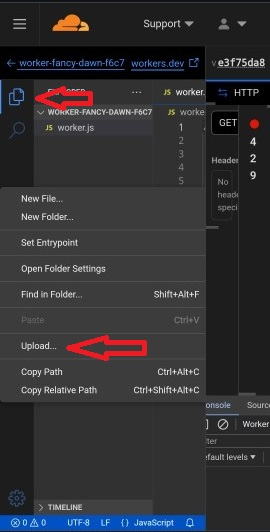
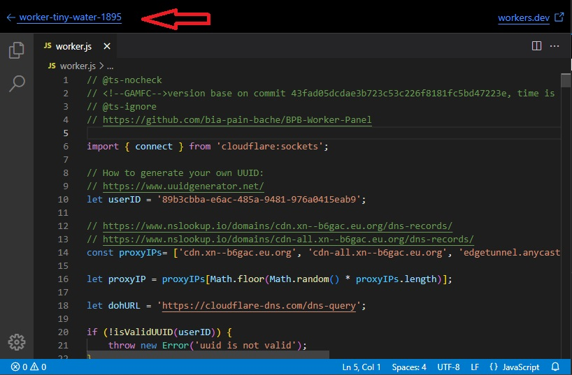
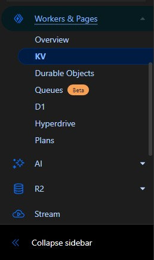
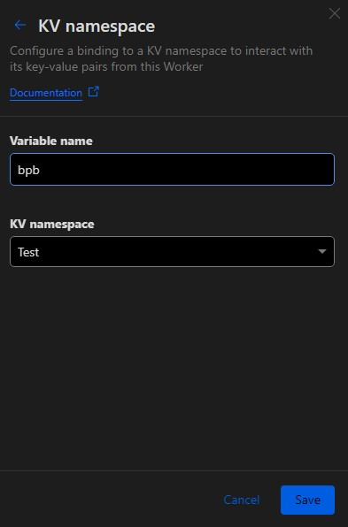
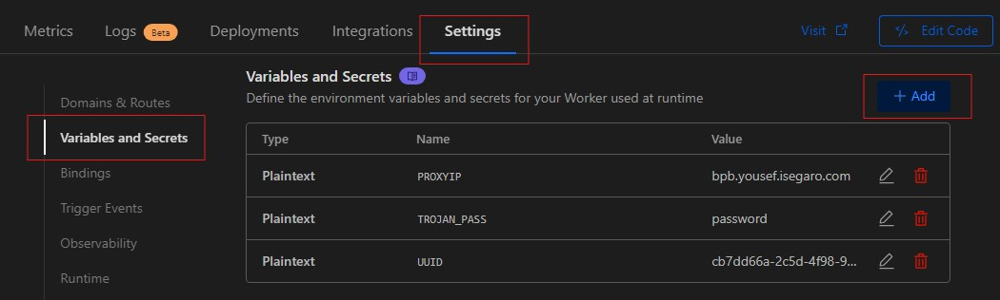
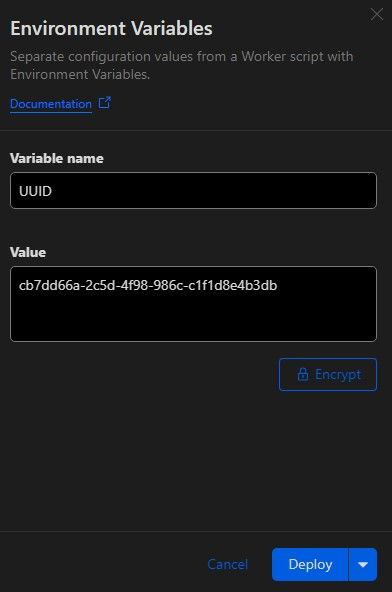

<h1 align="center">通过 Cloudflare Workers 安装</h1>

首先从[这里](https://github.com/bia-pain-bache/BPB-Worker-Panel/releases/latest/download/worker.js)下载 Worker 代码，然后点击你创建的 worker 的 Edit code，从左侧边栏删除 worker.js 文件并上传新文件。如果报错，也删除 package-lock.json 文件。由于代码量很大，在手机上复制粘贴比较困难，请按照下图上传。在手机上打开侧边菜单，长按并上传。

  

面板可以使用默认的 UUID、Proxy IP 和 Trojan 密码工作，你可以继续下一步，但如果想要更改这些设置，请查看[高级设置](#高级设置-可选)部分然后返回这里。

最后点击 `Save and Deploy` 部署 worker。
现在从这里返回到 worker 控制面板，按照以下步骤操作：

  

从这里进入 `KV` 页面：

  

在 KV 部分点击 `Create a namespace`，输入一个��定义名称（例如 Test）并点击 `Add`。

再次从左侧菜单进入 `Workers & Pages`，打开你创建的 worker，进入 `Settings` 部分找到 `Bindings`。点击 `Add` 并选择 `KV Namespace`，按照下图从下拉菜单中选择你创建的 KV（例子中是 Test）。重要的是上面的下拉菜单，必须设置为 `bpb` 然后点击 `Save`。

  

例如，假设你的 worker 域名是 worker-polished-leaf-d022.workers.dev，在末尾添加 `panel/` 进入面板。例如：

>`https://worker-polished-leaf-d022.workers.dev/panel`

系统会要求你设置新密码并登录，就这么简单。
安装到此完成，以下内容可能不是所有人都需要。
配置说明和注意事项都在[主要教程](configuration.md)中。
  

<h1 align="center">高级设置（可选）</h1>

你可能已经注意到我们没有提到更改 UUID、Proxy IP 和 Trojan 密码，因为你可以不进行这些设置而使用面板的默认设置。但我建议至少更改 UUID 和 Trojan 密码。
  

## 1- 更改 UUID：

UUID 就像一个密钥，它会出现在订阅链接和配置中，你可以根据需要更改它。更改此参数后，你的用户的连接将断开，需要为他们提供新的订阅链接或配置。如果你���这个阶段不设置 UUID，代码将使用默认的 UUID。
  

## 2- 固定 Proxy IP：

我们有一个问题，代码默认使用大量 Proxy IP，每次连接到 Cloudflare 后端的网站时（包括大部分网站）都会随机选择一个新的 IP，导致你的 IP 经常变化。这种 IP 变化对某些人来说可能是个问题（特别是交易者）。从版本 2.3.5 开始，你可以直接通过面板更改 Proxy IP，只需应用设置并更新订阅即可。但我建议使用下面介绍的方法，因为：

> [!CAUTION]
> 如果你通过面板设置 Proxy IP，当该 IP 失效时，你需要替换一个新的 IP 并更新订阅。这意味着如果你已经分享了配置给其他人，更改 Proxy IP 将不会生效，因为用户没有订阅来更新配置。因此建议这种方法只用于个人使用。但第二种方法（通过 Cloudflare 控制面板）的好处是不需要更新配置。
  

## 3- 更改 Trojan 密码：

Trojan 协议使用其默认密码工作，但考虑到很多人使用这个面板，我建议一定要更改它。

 

要更改 UUID、Proxy IP 和 Trojan 密码，从左侧菜单进入 `Workers & Pages`，打开你创建的 worker，进入 `Settings` 部分找到 `Variables and Secrets`：

  

在这里设置值。每次点击 `Add` 输入一个值然后点击 `Deploy`：

  

点击一次 `Add variable`，在第一个框中输入 `UUID`（大写），从[这里](https://www.uuidgenerator.net/)获取一个 UUID 并放在第二个框中。

再次点击 `Add variable`，在第一个框中输入 `PROXYIP`（大写），你可以从下面的链接获取 IP，打开后会显示一些 IP，你可以检查它们的国家并选择一个或多个：

>[Proxy IP](https://www.nslookup.io/domains/bpb.yousef.isegaro.com/dns-records/)

  

> [!TIP]
> 如果你想要使用多个 Proxy IP，可以用逗号分隔，例如：`151.213.181.145`,`5.163.51.41`,`bpb.yousef.isegaro.com`

再次点击 `Add variable`，在第一个框中输入 `TROJAN_PASS`（大写），设置一个自定义密码。
  

## 4- 连接域名到 Workers：

要做到这一点，进入 Cloudflare 控制面板，从 `Workers and Pages` 部分选择你的 worker。进入 `Settings` 部分，在最上面你会看到 `Domains & Routes`，点击 `Add +` 并选择 `Custom domain`。这里会要求你输入一个域名（注意你必须先购买一个域名并在同一账号上激活它，这里不详��说明）。假设你有一个域名叫 bpb.com，在 Domain 部分你可以输入域名本身或一个自定义子域名，例如 xyz.bpb.com。然后点击 `Add domain`。Cloudflare 会自动将 worker 连接到你的域名（这需要一些时间，Cloudflare 说可能需要最多 24 小时）。
然后你需要再次点击 `Add +` 并这次选择 `Route`，在 Zone 部分选择你的域名，在 Route 部分需要这样输入新域名：
> `*bpb.com/*`

完成后，你就可以通过 `https://xyz.bpb.com/panel` 访问你的面板并获取新的订阅。

> [!TIP]
> 1- 如果你将域名连接到 worker，就像 Pages 一样流量将变成无限制。
> 
> 2- worker 本身支持 nonTLS 端口如 80 和 8080 等，并在面板中显示，但如果连接了域名，这些端口将不再工作，面板也不会显示它们。 